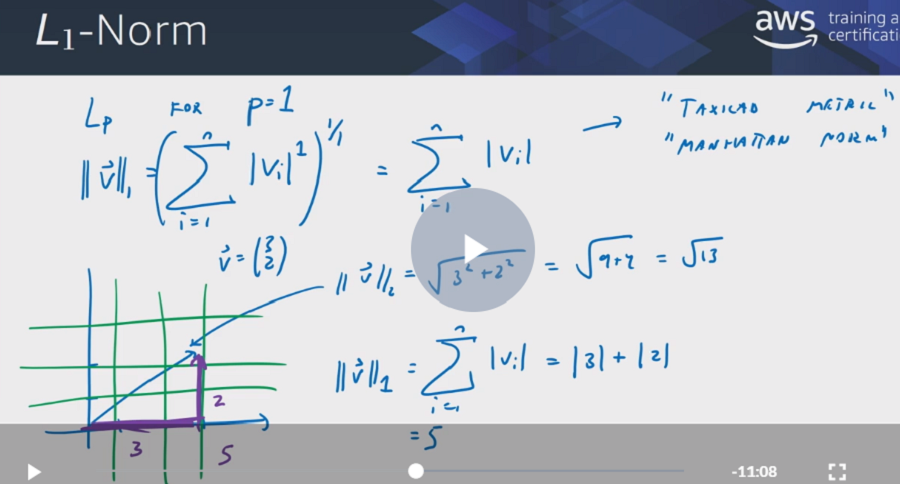
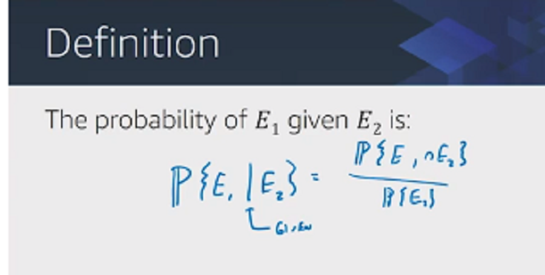

# Math for Machine Learning

## Vectors

### Measures of magnitude

#### L0 norm - not norm - aka sparsity - non zero count

#### L1 norm

#### L Infinity norm

#### L2 norm

#### L norm comparison

## Matrices

In this lesson we'll explore the machine learning task of feature extraction in linear algebraic terms. We'll discuss the conversion of these operations into math problems we can work with, so that we can ultimately be informed of what our data is doing. 

The following topics will be covered:
* A motivating example
* Dot Products and how to extract angles
* Matrix multiplication and examples
* Hadamard product
* Matrix product properties
* Geometry of matrix operations
* Determinant computation
* Matrix invertibility
* Linear dependency

### A motivating example

In this section we'll talk about establishing a motivating example, and the intuition reasoning behind matrix multiplication.

### Dot Products and how to extract angles

Let’s define the Dot Product of two vectors i.e. the relation between multiplied sums of individual components of two vectors, and magnitudes of individual vectors and angle between them.

### Matrix multiplication and examples

Now let's discuss how to multiply two matrices, when the number of columns of the first matrix and number of rows of the second matrix are equal.

### Hadamard product

This video covers the Hadamard product, an alternative matrix multiplication method that is useful in some of machine learning applications.

### Matrix product properties

Let’s verify the fundamental algebraic laws of Distributivity, Associativity, and Commutativity, with regard to regular Matrix multiplication and the Hadamard product. Remember that matrix multiplication is commutative if - and only when - both of the matrices are diagonal and of equal dimensions.

### Geometry of matrix operations

Here, we'll rearrange a sample 2x2 matrix so that it can be uniquely expressed as a stretching, a skewing, and a rotation transformation in space.

### Determinant computation

In this section we'll discuss how to identify the space volume (or the area for a two-dimensional matrix) changes during a matrix transformation, by computing the determinant of a matrix.

### Matrix invertibility

This section identifies when to invert a matrix, and how to find the inverse of a matrix.

### Linear dependency

In this last video we talk about the linear dependency of vectors - whether the given vectors all lie in single plane or not - and see how linear dependency defines whether the inverse of a matrix exists.

## Probability

Now that you’ve completed your study of vectors and matrices, let's discuss probability. Probability enables machines to manage outcomes and outputs. 

The following topics will be covered:
* Axioms of probability
* Probability represented with Venn diagrams
* Conditional probability
* Bayes’ rule
* Independent events and notation
* Random variables
* Chebyshev’s inequality
* Entropy
* Continuous random variables and probability density function
* The Gaussian curve
* Building machine learning models

### Probability Terminology

Sample Space: All observations, set of all outcomes
Event: Subset of your Sample Space
Probabilty: Fraction of times (occurrebnces) we see an event

### Probability axioms -to call it probability-

### Probability Visualization

### Conditional probability

### Bayes'Rule

### Independence

Sigma of probabilities if they are independent.

